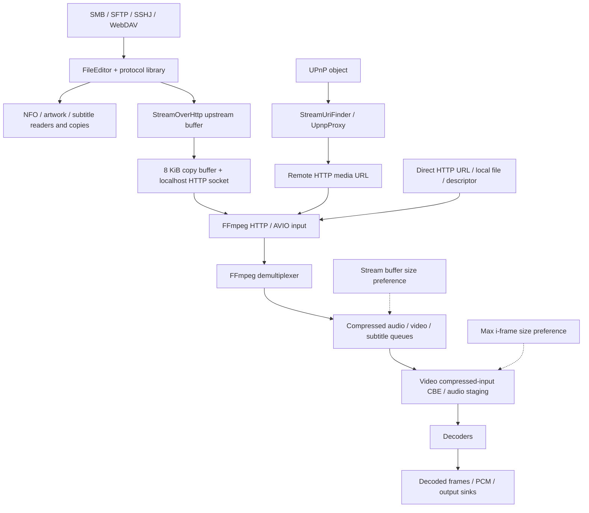

# Network and playback buffering in Nova

Source audit and reconciliation: 2026-09-25. Sizes in this document are binary
KiB/MiB, even where the UI says KB/MB. A network request size, a prefetch window,
a compressed-packet queue, and a decoded-frame pool are different controls.

## 1. Snapshot and scope

This is the canonical buffering document, combining the earlier media-I/O
overview with the detailed network/native audit and implementation follow-up.
All four repositories are now on **v6.4-lint**. The current source snapshot is:

| Repository | Revision before this documentation update | Role |
| --- | --- | --- |
| `Video` | `3cfb712b` | Preferences, player setup, external-player launch |
| `FileCoreLibrary` | `b777fe7` | Network/content stream ownership and proxy buffering |
| `MediaLib` | `c364ed6d` | Native content-descriptor routing and Java buffer validation |
| `native/avos` | `96d5f4f` | Native buffering and checked allocation arithmetic |

The original detailed audit used a mixed branch snapshot. Keep these revisions
as the historical baseline for the stable/lint comparisons below:

| Repository | Original audit revision | Role |
| --- | --- | --- |
| `Video` | `v6.4-stable`, `8841cbf30` | Preferences, player activity/service |
| `FileCoreLibrary` | `v6.4-lint`, `f8e57534` | Network editors and HTTP byte relay; defaults to jcifs nova10 |
| `MediaLib` | `v6.4-lint`, `8a405189` | Player/retriever wrappers and proxy lifecycle |
| `native/avos` | `v6.4-lint`, `fbecfc34` | Native input, demuxing, queues, decoding |

The main description includes the subsequent lint fixes in sections 12 and 13.
Section 13 records the additional committed implementation after these revisions. Stable
differences were checked against `FileCoreLibrary` `178c6b25`, `MediaLib` `8ec36666`, and
`native/avos` `2cf21c48`; they are called out below. Do not interpret the lint
native queue protections as a description of the stable native implementation.

Gradle uses published dependencies, not automatically the adjacent `external/`
checkouts. In particular, local `external/smbj` and `external/jsch` were upstream
checkouts rather than the published Nova forks. Their relevant tagged sources
were checked separately. The application dependencies are:

| Library | Version in audited FileCoreLibrary |
| --- | --- |
| jcifs-ng | `v2.1.11-nova10` on lint; `v2.1.11-nova9` on stable |
| SMBJ | `v0.15.0-nova2` |
| JSch | `jsch-2.28.7-readahead3` |
| SSHJ | `0.40.0` |
| Sardine | `v0.9-nova`, with OkHttp used for WebDAV file GETs |
| OkHttp logging-interceptor dependency | `5.5.0` |

The native build links prebuilt FFmpeg libraries through
[`jni/Android.mk`](../native/avos/jni/Android.mk). The local AVOS FFmpeg source
is `native/avos/ext/ffmpeg` at `n9.0.1`; the inspected arm64 prebuilt headers report
libavformat `63.1.101`. Source inspection is not proof of the exact binary
packaged in every APK/ABI. Verify the build manifest when comparing devices.

This is a source audit, not a new benchmark of all six protocols. The earlier
SMB measurements are recorded in section 10 with their limitations.

**Reconciliation:** current source resolves differences between the older overview
and detailed audit. jcifs default/sidecar refills are 64 KiB, cancellation avoids
interrupting jcifs, and JSch uses its dependency defaults of 32 KiB packets and a
2 MiB channel window; the current app does not configure 64 KiB / 4 MiB. External
video launches on lint explicitly select playback buffering, as described below.
Section 11 preserves the pre-fix findings; sections 12 and 13 record completed changes.

## 2. End-to-end paths



For proxied playback, the ownership/setup path is
`AvosMediaPlayer -> SmbProxy -> StreamOverHttp -> FileEditor`; the arrows above
show the direction of media bytes. Despite its name, `SmbProxy` also handles
SFTP, SSHJ, WebDAV, FTP/FTPS, and supported content URIs.

[`SmbProxy`](../MediaLib/src/com/archos/medialib/SmbProxy.java) resolves metadata,
creates the local HTTP server, passes its URL to the player/retriever, and stops
the server when its owner releases/replaces it. **It does not allocate another
large media cache.** “HTTP proxy” here means
[`StreamOverHttp`](../FileCoreLibrary/src/com/archos/filecorelibrary/StreamOverHttp.java),
not an additional buffering layer implemented by a separate `HttpProxy` class.

URI routing is selected by the actual editor, not merely by the apparent scheme:

| URI | Editor selection | Normal AVOS playback input |
| --- | --- | --- |
| `smb://` | jcifs, or SMBJ when the SMBJ preference is enabled | Local HTTP proxy |
| `smbj://` | SMBJ explicitly | Local HTTP proxy |
| `sftp://` | JSch, or SSHJ when its preference is enabled | Local HTTP proxy |
| `sshj://` | SSHJ explicitly | Local HTTP proxy |
| `webdav://`, `webdavs://` | WebDAV editor, remote HTTP/HTTPS GET | Local HTTP proxy |
| `upnp://` | Resolve the object's streaming resource URL | Usually direct remote HTTP |
| `http://`, `https://` | Native HTTP input in the normal player path | Direct URL, no Java share relay |
| `file://` / ordinary path | Native filesystem input | Direct path, no Java share relay |
| `content://` | Valid regular-file descriptor when available; content editor otherwise | Native descriptor with HTTP relay fallback |

See [`FileEditorFactory`](../FileCoreLibrary/src/com/archos/filecorelibrary/FileEditorFactory.java)
and [`AvosMediaPlayer`](../MediaLib/src/com/archos/medialib/AvosMediaPlayer.java).

For UPnP, [`PlayerService.onDataUriOK`](src/main/java/com/archos/mediacenter/video/player/PlayerService.java)
resolves `upnp://` with `StreamUriFinder` before playback. The generic
[`Proxy`](../MediaLib/src/com/archos/medialib/Proxy.java) entry points similarly
use [`UpnpProxy`](../MediaLib/src/com/archos/medialib/UpnpProxy.java), which passes
the resolved URL to the consumer. `UpnpProxy` is a URL resolver, not a media-byte
relay. `UpnpFileEditor.getInputStream()` is unimplemented and returns null; it is
not the UPnP playback transport. HTTP range support then belongs to the media
server and FFmpeg.

Local file paths and direct file descriptors bypass the Java share proxy.
Content URIs depend on the entry point. The implementation follow-up makes
`AvosMediaPlayer.setDataSource(Context, Uri, ...)` try a regular-file descriptor
with valid asset bounds before installing the relay. Pipes and unsupported
providers retain the proxy route. Explicit descriptor calls also bypass it.
AndroidMediaPlayer can reuse the same Java proxy
but has its own native buffering; the AVOS preferences do not configure it or
external players.

## 3. Java proxy buffers, ranges, and cancellation

### Refill policy

`StreamOverHttp` wraps the backend stream in a `BufferedInputStream`, then reads
from that buffer into an **8 KiB** array for socket writes. Thus an 8 KiB HTTP
copy loop does **not** imply 8 KiB SMB requests.

| Consumer/backend | Lint upstream capacity | Stable upstream capacity |
| --- | ---: | ---: |
| Primary jcifs playback via `SmbProxy` | 1 MiB | 64 KiB |
| jcifs metadata retrieval / generic default reader | 64 KiB | 64 KiB |
| jcifs subtitle/poster response | 64 KiB | 64 KiB |
| SMBJ, JSch, SSHJ, WebDAV, FTP/FTPS, relayed content | 80 KiB | 80 KiB |
| Socket-copy array, all these backends | 8 KiB | 8 KiB |

Lint's player overload of `SmbProxy.setDataSource` passes `ReadMode.PLAYBACK`;
the metadata-retriever overload uses `DEFAULT`. `upstreamBufferSize()` checks
`editor instanceof JcifsFileEditor`, so enabling SMBJ for `smb://` does not give
SMBJ the jcifs 1 MiB refill policy. Other constructors default to `DEFAULT`.

On the current Video lint branch,
[`PlayUtils`](src/main/java/com/archos/mediacenter/video/utils/PlayUtils.java)
also explicitly passes `ReadMode.PLAYBACK` when launching a remote video in an
external player. Its primary jcifs stream therefore gets the 1 MiB policy.
Separate subtitle delivery and generic file viewing use default constructors;
they retain the backend-specific default sizes above. This external-player
opt-in is already present in lint commit `769587334`; it is not a new runtime
change made by this reconciliation. AVOS preferences do not tune the external
player's own packet queues or decoder buffers.

The package-private benchmark constructor on lint can override the primary
response size explicitly. That diagnostic path is separate from production
policy. Stable has no such constructor at the audited revision.

### Bounded HTTP responses

For known response length `L`, `bufferResponseInput()`:

1. Places a byte-counting wrapper **below** the buffered stream.
2. Allocates `min(L, configured capacity)` bytes, or no buffered wrapper for zero.
3. Limits every backend refill to the bytes still owed by that HTTP response.

A 4 KiB range of a multi-gigabyte file therefore does not ask jcifs for a 1 MiB
read. Unknown-length responses use the configured finite buffer and read until
EOF. `copyStream()` handles short positive reads, rejects zero-progress reads,
and throws if the backend ends before a known response length is satisfied.

These bounds apply to calls made to the backend InputStream. **They do not
disable prefetch already implemented inside SMBJ, JSch, or SSHJ.**

For seekable, known-length inputs, the proxy supports a single byte range and
returns `206` with `Content-Range`/`Content-Length`. It opens a backend stream at
the requested offset. Unknown-length/nonseekable streams can ignore Range and
serve a full `200` response from zero. Responses use HTTP/1.0 and
`Connection: close`; a new range can require a new HTTP connection and backend
file handle, while the protocol library may reuse its server connection.

### Ownership and cancellation

Each accepted HTTP connection has a session/worker. There is a **16-session
limit per StreamOverHttp instance**, counting unfinished cleanup as well as live
reads. It is not a global process memory cap. Request headers have a 64 KiB limit
and a 10-second read timeout; these are not media-buffer settings.

A new primary-media request supersedes the previous primary-media session;
poster/subtitle requests do not take over that slot. Stop closes the listener
and cancels sessions. Cancellation always closes the local socket. Then:

* **jcifs:** cancellation is cooperative, selected before metadata/file access.
  The owner finishes or times out the outstanding SMB operation and closes its
  input in `finally`. Interrupting a sent jcifs response wait retires the shared
  transport and could disrupt other requests, so the proxy avoids that interrupt.
* **Other backends:** the worker is interrupted and upstream close can run on a
  separate cleanup thread. Cleanup remains counted until finished. This does
  not guarantee immediate cancellation of every library's already-sent request.

Larger refills increase potential in-flight work and discarded data during seeks.
The range bound and cancellation policy address different problems.

### Scraping, sidecars and small files

[`NfoParser`](../MediaLib/src/com/archos/mediascraper/NfoParser.java) and
[`SmbRequestHandler`](src/main/java/com/archos/mediacenter/video/picasso/SmbRequestHandler.java)
obtain `FileEditor` streams directly. They bypass the playback proxy's refill
policy and AVOS queues, although their backend can still prefetch internally.
[`ImageScaler.copyFile()`](../MediaLib/src/com/archos/mediascraper/ImageScaler.java)
copies artwork with an **8 KiB** array.
[`CopyCutEngine`](../FileCoreLibrary/src/com/archos/filecorelibrary/CopyCutEngine.java)
uses **32 KiB** chunks; remote subtitle prefetch in
[`SubtitleManager`](src/main/java/com/archos/mediacenter/video/browser/subtitlesmanager/SubtitleManager.java)
uses that engine.

Video metadata and thumbnail retrieval are different: remote-media retrieval
uses the player/retriever adapter with default proxy buffering. A large movie
opened briefly for a hash or thumbnail is still a short-lived reader. Read-ahead
policy should follow consumer intent and response bounds rather than MIME type
or total file size alone. Concurrent scraping matters when evaluating playback
throughput, shared connections, allocation pressure and cancellation.

The proxy's 8 KiB copy buffer is not `SO_SNDBUF`, a TCP packet size or an MTU.
Kernel socket queues have their own capacities and flow control.

## 4. Backend buffering and flow control

### jcifs-ng

[`JcifsUtils`](../FileCoreLibrary/src/com/archos/filecorelibrary/jcifs/JcifsUtils.java)
configures SMB2 send/receive limits of **1 MiB**. The negotiated server maximum
can reduce the usable read size. These properties are SMB transport limits, not
the native playback queue size or a request to resize the OS TCP receive window.

[`JcifsFileEditor`](../FileCoreLibrary/src/com/archos/filecorelibrary/jcifs/JcifsFileEditor.java)
opens `SmbFileInputStream`; starting at an offset uses its `skip()` to advance the
file position, rather than downloading the preceding file bytes. The stream
performs synchronous reads without the discarded nova8 read-ahead pipeline.
There is no 1 MiB background prefetch simply because its configured maximum is
1 MiB. Caller demand, negotiation, and credits determine the actual request.

For a positive SMB2 read length `N`, the credit cost is `ceil(N / 65536)`:

| Requested bytes | Credits |
| ---: | ---: |
| 64 KiB | 1 |
| 80 KiB | 2 |
| 128 KiB | 2 |
| 512 KiB | 8 |
| 1 MiB | 16 |

**nova9** waits for the request's full cost. If the server leaves the transport
with fewer credits and there are no replies in flight to replenish them, a
large read can wait until timeout. Stable's 64 KiB refills avoid requiring more
than one credit for these proxy reads; they do not solve arbitrary network stalls.

**nova10** explicitly opts regular-file stream/random-access reads into adaptive
sizing. For an eligible standalone large-MTU SMB2 read, the transport reserves
up to the requested credits and shortens the wire length before credit charging
and message-ID allocation. With zero available credits it waits for one, then
takes any extras without waiting to fill the whole requested window. One
available credit permits a 64 KiB response to a 1 MiB caller read. Normal short
read semantics and file-offset advancement preserve the byte stream.

The adaptation does not apply to writes, arbitrary compound requests, named
pipes, or READ users that have not opted in. Minimum-count/unbuffered constraints
also prevent adjustment. Credits are shared by a transport, so metadata and
playback can compete. Only actual server grants replenish the window.

Buffer ownership also matters: `doRecvSMB2()` allocates a response-message byte
array and `Smb2ReadResponse` copies the payload to the caller's buffer. The proxy
upstream array is therefore not the sole Java allocation for a read. A small
READ request does not require a 1 MiB outgoing payload buffer.

Sources: [nova10 transport](https://github.com/nova-video-player/jcifs-ng/blob/v2.1.11-nova10/src/main/java/jcifs/smb/SmbTransportImpl.java),
[read request](https://github.com/nova-video-player/jcifs-ng/blob/v2.1.11-nova10/src/main/java/jcifs/internal/smb2/io/Smb2ReadRequest.java),
[file stream](https://github.com/nova-video-player/jcifs-ng/blob/v2.1.11-nova10/src/main/java/jcifs/smb/SmbFileInputStream.java).

### SMBJ

[`SmbjUtils`](../FileCoreLibrary/src/com/archos/filecorelibrary/smbj/SmbjUtils.java)
does not override `SmbConfig`'s default **1 MiB** read buffer. `Share` limits it
to the server's negotiated maximum. The published library's `FileInputStream`
keeps the current response data and **one next asynchronous read**. Consuming
80 KiB through the Java proxy can therefore drive approximately 1 MiB backend
reads plus a next request; it is not a synchronous 80 KiB SMB loop.

SMBJ assigns credits under the connection lock, reduces the usable request
size to assigned credits, and ordinarily tries to leave a credit for another
request when the window is constrained. Its credit behavior should not be
inferred from jcifs's nova9 behavior. The default operation timeout is 60 seconds;
it is a separate control from buffer capacity.

[`SmbjFileEditor`](../FileCoreLibrary/src/com/archos/filecorelibrary/smbj/SmbjFileEditor.java)
opens a read-only handle. Legacy callers and full playback use the library stream
and logical `skip(from)`. Metadata and finite ranges ending before EOF now use
explicit-offset `File.read()` calls, capped at 64 KiB and the remaining response
length, avoiding the library stream's automatic next-read prefetch. An owning
wrapper closes the stream and remote handle with `closeNoWait()` when connected.
Full playback still has library read-ahead in flight at cancellation.

Sources: [tagged FileInputStream](https://github.com/nova-video-player/smbj/blob/v0.15.0-nova2/src/main/java/com/hierynomus/smbj/share/FileInputStream.java),
[SmbConfig](https://github.com/nova-video-player/smbj/blob/v0.15.0-nova2/src/main/java/com/hierynomus/smbj/SmbConfig.java),
[connection credit allocation](https://github.com/nova-video-player/smbj/blob/v0.15.0-nova2/src/main/java/com/hierynomus/smbj/connection/Connection.java).

### SFTP through JSch

[`SFTPSession`](../FileCoreLibrary/src/com/archos/filecorelibrary/sftp/SFTPSession.java)
caches SSH sessions and opens a separate SFTP channel for a stream. The checked
code now calls `setBulkRequests()`: metadata and bounded subranges use one request;
legacy/full-playback reads retain 16. Diagnostics may override the latter.
The app still does not call the fork's packet/window setters.

In the selected JSch tag, `ChannelSftp` defaults to a **32 KiB local maximum SSH
packet**, a **2 MiB local channel window**, and a **16-request SFTP queue**. For
modern SFTP versions the stream's normal READ payload is `32768 - 13 = 32755`
bytes. Its request window ramps from one toward the queue limit, rather than
performing just one outstanding read forever. The receive pipe is also buffered
and sized using the request queue and negotiated remote packet size.

Consequently the proxy's 80 KiB refill is neither an SSH packet size nor the
maximum total in-flight SFTP data. Short InputStream reads remain normal.
[`SftpFileEditor`](../FileCoreLibrary/src/com/archos/filecorelibrary/sftp/SftpFileEditor.java)
uses `ChannelSftp.get(path, ..., from)` for offset reads. Stream close disconnects
that channel and releases its session usage; the cached SSH connection can
survive. The implementation follow-up uses `OwnedStreams` to run cleanup even if
the library close throws, serialize close with reads, and prevent double close.
Failed stream construction also releases the acquired channel.

Source: [published ChannelSftp](https://github.com/nova-video-player/jsch-mwiede/blob/jsch-2.28.7-readahead3/src/main/java/com/jcraft/jsch/ChannelSftp.java).

### SFTP through SSHJ

[`SshjFileEditor`](../FileCoreLibrary/src/com/archos/filecorelibrary/sshj/SshjFileEditor.java)
uses `ReadAheadRemoteFileInputStream(16, from)` for legacy/full-playback reads.
Metadata and bounded subranges use `RemoteFileInputStream(from)` with a strict
remaining-byte wrapper, so those reads are synchronous and have no read-ahead.
The following pipeline sizes describe the full-playback path.

In SSHJ 0.40.0, each new request is sized approximately as
`min(max(1024, callerLength), learnedMaximumReadLength)`. Short server replies can
lower the learned maximum. The fill condition is `queue.size() <= 16`, so it can
enqueue **17** requests before consuming one response. With an initial 80 KiB
caller read, that is potentially 1.328 MiB of requested data; it is not a promise
that all that memory is allocated immediately or that the server returns 80 KiB.

The three-argument constructor can bound read-ahead, but Nova uses the overloads
without a finite range limit for full playback. Short bounded HTTP subranges now
select the synchronous path instead of that constructor. In the audited baseline, the observable
ownership wrappers were commented out. SSHJ's read-ahead stream inherits the
no-op `InputStream.close()`; its output-stream close only flushes writes. Remote
handles could therefore accumulate. The implementation follow-up wraps both
directions in `OwnedStreams`, explicitly closes the `RemoteFile`, and preserves
the shared SFTP connection when one handle's close fails. This corrects the
initial audit's claim that the old observable wrapper was active.

Source: [SSHJ 0.40.0 RemoteFile](https://github.com/hierynomus/sshj/blob/v0.40.0/src/main/java/net/schmizz/sshj/sftp/RemoteFile.java).

### WebDAV / WebDAVS

[`WebdavFileEditor`](../FileCoreLibrary/src/com/archos/filecorelibrary/webdav/WebdavFileEditor.java)
uses OkHttp GET and returns `ResponseBody.byteStream()`. Directory metadata uses
the Sardine/WebDAV side of the implementation; media bytes use a streaming HTTP
response. There is no explicit Nova whole-file cache or parallel range downloader.
OkHttp/Okio, TLS, and TCP have their own buffers in addition to the proxy's 80 KiB.

An offset read sends `Range: bytes=from-`. The editor requires `206` and validates
the exact start in `Content-Range`; `416` or a misleading `200` response fails
instead of silently serving the wrong bytes. The proxy separately bounds a
finite client range, since the outgoing WebDAV range is open-ended. Closing the
body stream releases its HTTP response resources; the client may pool connections.

### FTP / FTPS

[`FtpFileEditor`](../FileCoreLibrary/src/com/archos/filecorelibrary/ftp/FtpFileEditor.java)
uses FTP data-stream delivery through the Commons Net client. Data-connection
socket/library buffering remains separate from the proxy's 80 KiB refill;
FTPS adds TLS processing. These transport buffers are not controlled by the
AVOS preferences. FTP is included here for architectural completeness, without
claiming a new FTP performance audit or benchmark.

### UPnP and direct HTTP

UPnP discovery and object lookup are control operations. The media server's
resource URL supplies the byte stream. In the ordinary playback route this skips
the 80 KiB/1 MiB Java relay entirely and reaches FFmpeg's HTTP input. Transport
throughput, range support, and server transcoding can differ from SMB even when
the underlying movie is the same. AVOS queue preferences still apply once AVOS
plays that URL.

## 5. Native input and demux buffering

The major native path is
[`stream_parser_ffmpeg.c`](../native/avos/Source/stream_parser_ffmpeg.c), which
registers the FFmpeg parser for common formats including MKV, MP4, AVI, and MPEG.
It opens the supplied URL with `avformat_open_input()` and reads packets with
`av_read_frame()`. This path does **not** construct the legacy `STREAM_BUFFER`
raw-byte ring via `stream_parser_open()`.

### HTTP/AVIO buffering and probing

There are buffers inside FFmpeg independently of Nova's queue budget:

* The inspected FFmpeg source starts ordinary URL AVIO buffering at **32 KiB**
  when no protocol maximum packet size overrides it; streamed read inputs double
  that initial size. AVIO/probing can resize or bypass buffering, so this is not
  a fixed limit on network reads. See [avio.c](../native/avos/ext/ffmpeg/libavformat/avio.c).
* Direct `fd://` slices use a custom AVOS AVIO adapter with a **32 KiB** allocation,
  keeping reads/seeks relative to the descriptor's start/length.
* Playback sets `probesize=10000000` bytes. Thumbnail mode uses `500000` bytes and
  `analyzeduration=1000000` microseconds. The separate metadata `_get_info_FFMPEG`
  path also sets the smaller probe and a 30-second cancellation deadline in the
  audited lint native code. These are probe controls, not steady-state refill sizes.
* The lint HTTP options set `rw_timeout=30000000` microseconds, with a separate
  interrupt callback for stop/seek. This is not a 30-second playback cache.

The metadata-only `_get_info_FFMPEG` probe is not a full playback instance and
does not allocate the playback packet queues/CBE merely because their defaults
are configured. Thumbnail decoding can enter the stream/decoder path and has
different memory needs from metadata-only format inspection.

For a proxied URL, FFmpeg reads from localhost while Java reads the remote server.
For UPnP/direct HTTP, FFmpeg itself owns the remote connection. OS socket queues
and TLS/protocol buffers are additional allocations, not explicitly sized by
either of the two VideoPreferences settings.

### Compressed-packet queues and backpressure

The AVOS parser thread calls the FFmpeg parser; `_parse()` attempts up to five
packet reads per call. Selected packets enter `aq`, `vq`, and `sq` for audio,
video, and subtitles. Consumers remove them for decoding. The configured stream
buffer is a **shared byte budget**, not that amount independently per queue.

In the audited **lint native** implementation:

* `_open()` bounds the received byte budget to `[1 MiB, INT_MAX/2]`.
* Accounting includes packet nodes, payloads, and side data; packet buffers use
  FFmpeg references, so accounted bytes are not a precise process-RSS measure.
* Normal demux reads pause after queue memory exceeds the nominal budget, or when
  a selected queue reaches **8192 packets**. Packet-count backpressure matters for
  small audio packets even when many budget bytes remain.
* One admitted packet can cross the normal budget. Aggregate media queue
  admission is bounded at **2 × budget**; an individual packet whose accounted
  cost exceeds the budget fails explicitly.
* If audio is starved, demuxing can continue looking for audio. Video dropping
  and keyframe recovery bound that search instead of retaining unlimited data.
* Seek preroll has a separate rolling audio limit around half the budget, plus
  the packet-count guard. Seeking flushes old queues and cached subtitle history.
* Internal subtitle history is separate: **8 MiB / 2048 packets**, with timed or
  format-specific retention. It is not included in the `aq + vq + sq` budget.

These limits are not a whole-player memory ceiling: FFmpeg internals, the packet
being read, codec buffers, reference frames, subtitles, Java, and sockets add more.
The statistics view also reports `aq + vq` as `buffer_used`, omitting `sq` and the
subtitle history; it should not be treated as total memory usage.

**Stable native differs:** its nominal budget already applies to demuxed packet
queues, but it lacks the lint packet-cost/count and 2× admission machinery. Its
audio-starvation path continues past the normal cap and selectively drops video.
Do not claim a strict 24 MiB or 48 MiB queue bound for that stable implementation.

When queues are full, demux stops reading. FFmpeg's input then stops draining the
socket, Java socket writes eventually block, and backend consumption slows after
its finite internal prefetch. This is the end-to-end backpressure chain. The
proxy itself has no movie-length producer queue.

### Legacy raw-buffer path

[`stream_parser.c`](../native/avos/Source/stream_parser.c) also implements a
different path: `STREAM_IO -> STREAM_BUFFER -> parser/chunk stores`. It allocates
the stream budget as a raw-byte ring plus `VIDEO_OVERLAP_SIZE`, a compile-time
**6 MiB** wraparound region. The default I/O chunk starts at **32 KiB**
(`stream_buffer_sec=64` sectors × 512 bytes); this has no relationship to the
Java 64 KiB compatibility refill despite the similar names.

Here `parser_mindata_size` defaults to the max-i-frame setting, and opening can
prebuffer `1.5 × mindata` unless disabled. This is where “buffer before parser”
and parser minimum-data thresholds really apply. Do not add this raw ring to
the FFmpeg packet queues as though ordinary FFmpeg playback always allocated both.

## 6. VideoPreferences and the JNI path

[`VideoPreferencesFragment`](src/main/java/com/archos/mediacenter/video/utils/VideoPreferencesFragment.java)
delegates preference handling to
[`VideoPreferencesCommon`](src/main/java/com/archos/mediacenter/video/utils/VideoPreferencesCommon.java).
Both settings are persistent string-backed `EditTextPreference`s in
[`preferences_video.xml`](res/xml/preferences_video.xml). They are displayed
with advanced settings enabled. Hiding advanced settings does not clear their
stored values.

These are intentional advanced-user controls. Keep their numeric flexibility;
the recommendations below concern accurate units/semantics, defined zero behavior,
checked arithmetic and allocation failure handling, not removing the controls or
imposing arbitrary small limits.

| Preference | Stored key | Default | Effective purpose |
| --- | --- | ---: | --- |
| `KEY_STREAM_BUFFER_SIZE` | `stream_buffer_size` | 24 | MiB budget for AVOS packet queues on FFmpeg; raw ring size on legacy parsers |
| `KEY_STREAM_MAX_IFRAME_SIZE` | `stream_max_iframe_size` | 6 | MiB fallback capacity for compressed-video input CBE; legacy parser minimum data |

The call chain is:

```text
PlayerActivity.onStart(): getString(), Integer.parseInt(), default on parse error
  -> LibAvos.setStreamBufferSize() / setStreamMaxIframeSize()
  -> nativeSetStreamBufferSize() / nativeSetStreamMaxIframeSize() [JNI]
  -> libavos_set_default_stream_buffer_size() / ...max_iframe_size()
  -> define_default_stream_buffer_size() / ...max_iframe_size()
```

Sources: [PlayerActivity](src/main/java/com/archos/mediacenter/video/player/PlayerActivity.java),
[LibAvos.java](../MediaLib/src/com/archos/medialib/LibAvos.java),
[JNI libavos.c](../native/avos/jni/libavosjni/libavos.c),
[native libavos.c](../native/avos/Source/libavos.c),
[stream.c](../native/avos/Source/stream.c).

The stream default is initially stored in MiB. `avos_mp_video.c` supplies it to a
new stream for nonlocal playback (including localhost HTTP), and also for local
playback on devices without an HDD. `stream_video.c` multiplies it by `1024*1024`
when opening the parser. A zero stream value falls through to the separate
`STREAM_DEFAULT_BUFFER_SIZE` of **64 MiB**, rather than meaning “no buffering”.
There are also native debug overrides; the UI default is nevertheless 24 MiB.

The max-i-frame setter immediately converts MiB to bytes. These are global
native defaults consumed at stream/parser/decoder-buffer setup; the setters do
not resize every existing active buffer in place. They do not change jcifs
credits, SMBJ prefetch, SSH windows, the proxy's Java arrays, or FFmpeg's initial
AVIO buffer size.

The implementation follow-up validates these values in both `LibAvos` and native
code before byte conversion/allocation. Stream values account for the legacy
6 MiB overlap; frame values account for the CBE's doubled backing allocation.
Unrepresentable or negative values use the 24/6 MiB defaults. Zero retains the
64 MiB stream fallback and now explicitly selects the 6 MiB frame default.

### What “Max i-frame size” actually allocates

[`_allocate_video_buffers()`](../native/avos/Source/stream_video.c) picks
`video_rc.mem_size` if supplied by the decoder, otherwise the preference's byte
value, then calls `cbe_new(size, size, type)`.
[`cbe_new()`](../native/avos/Source/cbe.c) allocates **size + overlap**. With the
default 6 MiB fallback, this is **12 MiB of backing storage** for a 6 MiB logical
circular buffer. The second half allows contiguous access across wraparound;
it is not another six megabytes of independently queued compressed media.

The CBE stages compressed video access units, including non-I frames. In lint,
`_get_video_cdata()` checks capacity including codec extra data and Annex B NAL
conversion expansion. An access unit must fit below the logical capacity; being
smaller than a raw 6 MiB packet is not by itself sufficient if conversion adds
bytes. Insufficient free space waits for consumption; an access unit that cannot
fit is rejected. This is distinct from the demux queue budget.

Raising this setting can help a capacity failure on a large compressed frame,
but does not make the network faster. It increases the fallback CBE allocation
by roughly **2 MiB for every additional MiB configured**. Decoder-specific
`mem_size`, decoded-frame pools, MediaCodec input/output buffers, and output
surfaces remain separate.

## 7. Memory and latency interpretation

A useful inventory for one active proxied video is:

```text
Java proxy refill + 8 KiB copy array
+ backend response / prefetch / SSH or TLS buffers
+ remote and loopback OS socket queues
+ FFmpeg AVIO, probing, demux internal state
+ selected compressed-packet queues
+ compressed-video CBE backing storage
+ audio staging / subtitle caches
+ decoded video surfaces, codec references, PCM and output-device buffers
```

With the normal FFmpeg path and default settings, “24 MiB stream buffer” plus
“6 MiB max i-frame” is **not a 30 MiB total-memory limit**. The CBE fallback alone
uses 12 MiB, and the 24 MiB queue budget is neither all the memory nor a mandatory
allocation that must fill before playback starts. Multiple proxies/retrievers
and cancelled-but-unfinished requests can coexist.

Decoded reference/reordered pictures, render queues and audio decode/filter/sink
buffers depend on the codec, resolution, pixel format and output mode. Hardware
surface memory may not appear in the Java heap. Compressed-file bitrate therefore
does not determine decoded-frame memory, and neither preference is a total-player
memory limit.

Approximate cached media duration is `queued payload bytes / encoded bytes per
second`, not `buffer size / network throughput`. At 100 Mbit/s, 24 MiB represents
about two seconds of encoded media before overhead, stream distribution, and
variable bitrate are considered. No cache fixes a sustained transfer rate below
the required media bitrate; a larger queue mainly absorbs temporary deficits.

For synchronous request/response reads, throughput is constrained by request
size and round-trip latency as well as link speed. Prefetch lets multiple reads
overlap. This explains why increasing jcifs caller refills can help much more
than increasing the outer buffer of an already-prefetching SMBJ/SSHJ stream.

## 8. Findings and follow-up candidates

These findings describe the original audit and its remaining follow-up work:

Items 1 and 2 are addressed by the implementation follow-up in section 12;
the other distinctions and performance candidates remain applicable.

1. **UI description is misleading for FFmpeg playback.** The stream-buffer
   summary and Java default comment say “before parser”; the active FFmpeg
   implementation uses it for demuxed compressed-packet queues. Describe both
   paths or use a general “compressed media buffer” description.
2. **Validate preference ranges before native conversion/allocation.** Java
   handles malformed strings but accepts zero and arbitrarily large parseable
   integers. The native MiB-to-byte multiplication uses `int`; FFmpeg's later
   clamp cannot protect a multiplication that already overflowed. Zero also has
   different behavior for the two settings. Use checked wide arithmetic and
   validate against actual native representability/allocation constraints at the
   JNI/native boundary too. Retain advanced tuning rather than adding arbitrary
   small UI limits.
3. **Keep stable and lint buffering claims separate.** Stable's nova9 plus
   64 KiB avoids multi-credit proxy reads. Lint's nova10 makes larger reads adapt
   to credits. Native queue safeguards also differ substantially between branches.
4. **Short-response bounds stop at the InputStream API.** SMBJ/SSHJ/JSch may
   already have further data in flight. For metadata workloads, consider
   bounded/read-ahead-disabled backend streams separately from proxy capacity.
5. **Displayed buffer statistics are incomplete memory accounting.** FFmpeg's
   `buffer_used` omits selected subtitles and retained subtitle history, and
   neither it nor the UI value includes decoded surfaces or protocol buffers.
6. **Cancellation remains backend-specific.** jcifs uses cooperative cleanup to
   protect pooled transports; larger outstanding reads can still delay releasing
   a session. An HTTP client disappearing does not instantly free all backend
   resources. The per-proxy admission bound limits accumulation, not duration.
7. **Backend source trees can mislead an audit.** Changing `external/jsch` or
   `external/smbj` does not modify a Gradle build using a published artifact.
   Verify the resolved artifact/tag, and the prebuilt native libraries, first.

## 9. How to diagnose and tune the right layer

| Symptom | First layer to inspect |
| --- | --- |
| Stable SMB stalls requesting large chunks on some servers | Credit window versus request cost; nova9/nova10 and actual editor |
| Slow steady reads on a high-latency link | Protocol request size and prefetch window, then Java refill policy |
| Playback drains its cache during brief network dips | AVOS packet budget versus encoded bitrate and available buffered duration |
| One unusually large video access unit fails | CBE logical size, codec extra/conversion expansion, decoder capacity |
| Slow thumbnail/probe/seek and excessive network reads | Metadata read mode, FFmpeg probing, backend read-ahead and cancellation |
| High RSS despite a small stream preference | Protocol buffers, queue exceptions, CBE overlap, subtitle history and decoded surfaces |
| UPnP behavior differs from SMB | Direct HTTP server/FFmpeg path; do not assume StreamOverHttp settings apply |

Change one layer at a time. An HTTP transfer benchmark measures source-to-client
delivery; it does not exercise native parser budgets, decoder buffers, audio
output, or real playback resilience. Test these separately on target devices.

## 10. Existing SMB measurements and verification limits

Read-only tests on 2026-09-24 used the same **736,111,567-byte** file through the
local HTTP proxy over VPN. Addresses and credentials are intentionally omitted.

| Setup | Proxy refill | Seconds | MiB/s |
| --- | ---: | ---: | ---: |
| Stable + nova9, first run | 64 KiB | 106.96 | 6.56 |
| Stable + nova9 | 80 KiB | 97.59 | 7.19 |
| Stable + nova9, repeat | 64 KiB | 117.88 | 5.96 |
| Stable + nova9 | 128 KiB | 94.05 | 7.46 |
| Lint + nova10, earlier run | 1 MiB | 56.56 | 12.41 |

All reported the same transferred byte count and no transfer error. The
diagnostic does **not** assert a reference file hash and can report individual
transfer failures without failing JUnit. Read the result rows, not merely
`BUILD SUCCESSFUL`. The 80/128 KiB stable experiments used temporary source
overrides; they did not change stable's production default.

VPN variation is visible in the two 64 KiB results. The 128-versus-80 KiB gain was
only about 4%, so these runs do not establish a precise or universal advantage.
The 1 MiB result changed both branch/library and refill size; it is not an
isolated measurement of the adaptive-credit algorithm. No live test forced the
server to grant only one credit. That behavior was covered by library tests.

Previously completed automated validation comprised 20 jcifs credit/framing/read
tests and 42 lint proxy/cancellation/WebDAV tests. The jcifs tests included
synthetic file-content hashes, changing credit windows, concurrency, offsets,
EOF, timeout and interruption. This audit adds no claim of new live SMBJ, SFTP,
SSHJ, WebDAV, UPnP, or native device-playback testing.

For lint's host diagnostic, run from `Video`:

```sh
./gradlew :FileCoreLibrary:testDebugUnitTest --tests '*SpeedTestTransferTest' \
  -Dnova.test.speedtestCsv=/absolute/path/to/servers.csv \
  -Dnova.test.speedtestUpstreamBufferBytes=1048576
```

The explicit size overrides the diagnostic's primary response for every listed
backend; without it, lint's diagnostic defaults to 80 KiB rather than selecting
the production playback mode. Stable's audited diagnostic uses the production
64 KiB jcifs policy and has no buffer-size property support. Neither diagnostic
runs AVOS, so changing `KEY_STREAM_BUFFER_SIZE` or `KEY_STREAM_MAX_IFRAME_SIZE`
cannot establish their impact through this transfer test. Keep server CSVs and
credentials out of commits and public logs.

The host diagnostic replaces AVOS with a Java HTTP client using a **256 KiB**
read buffer. That client buffer stays fixed when the upstream override changes.
See [the host buffer comparison procedure](doc/TEST.md#comparing-upstream-buffer-sizes-host-only)
for controlled comparisons; its nova7/nova8 examples describe earlier experiments,
while the audited current dependency is nova10. Repeat runs in different orders
to reduce cache and network variation, then validate real first-frame latency,
seeking, stop/reopen, high-bitrate peaks, memory/GC and concurrent sidecar work on
Android. Host throughput alone does not justify changing every buffer or the
24/6 MiB AVOS defaults.

## 11. SMB, SFTP and local-storage comparison and optimization priorities

This follow-up is source analysis, not a new throughput measurement. The SSHJ,
JSch, local-editor and content-editor files discussed below are identical between
the audited FileCoreLibrary stable and lint refs. SMB buffer/credit behavior and
native descriptor capabilities must still be evaluated against the chosen branch.
The findings below describe the pre-fix baseline; section 12 records what has
subsequently been committed on lint.

### Differences that should remain protocol-specific

| Input | Caller refill / transfer behavior | Likely constraint and useful tuning layer |
| --- | --- | --- |
| jcifs on stable | 64 KiB relay refill; synchronous reads; nova9 | Round-trip latency and credit availability; retain one-credit safety with nova9 |
| jcifs on lint | 1 MiB playback refill; synchronous reads; nova10 can shorten to available credits | Larger requests amortize latency; adaptation ensures progress but does not add read-ahead |
| SMBJ | 80 KiB relay refill; library reads up to negotiated 1 MiB and prefetches the next response | Library request size, credit window, server caching and concurrency |
| JSch SFTP | 80 KiB relay refill; roughly 32 KiB READs, ramping toward 16 outstanding | Pipeline depth, SSH flow control, encryption CPU and network latency |
| SSHJ SFTP | 80 KiB relay refill influences READ length; up to 17 queued requests at the configured value 16 | Pipeline depth and server reply limits; lifecycle bugs must be fixed first |
| Ordinary local path | Native FFmpeg input; no Java relay refill | Storage/page-cache behavior, native demux and decoding |
| Local file exposed as content URI | Current URI entry point uses the Java relay with 80 KiB refill | Avoidable local socket/copy overhead and provider/descriptor handling |

Equal buffer sizes would not make these paths equivalent. Increasing the JSch
outer refill to 1 MiB does not turn its protocol reads into 1 MiB reads. Increasing
SSHJ's refill can enlarge its requested read-ahead substantially, until the server
limits replies. SMBJ already prefetches independently. Local small reads do not
incur a remote SMB/SFTP round trip and may benefit from OS caching/read-ahead.

As a latency-only estimate, one 1 MiB synchronous request per 50 ms permits about
20 MiB/s, while one 64 KiB request permits about 1.25 MiB/s. JSch's full request
window is roughly 512 KiB, suggesting about 10 MiB/s at that latency. These are
illustrations, not measured ceilings: ramp-up, transfer time, server grants,
SSH windows, encryption and scheduling alter the results. Increasing AVOS's
24 MiB queue cannot enlarge any of these protocol windows.

### First priority: resource ownership and recovery

1. **SSHJ remote handles are not closed by returned streams.** Both read
   overloads in `SshjFileEditor` return a stream with no effective close, as
   explained in section 4. Every reopened range/seek can leave another remote
   handle behind. Restore explicit, idempotent handle ownership, including setup
   failure paths, and handle pending replies without disconnecting unrelated
   streams sharing the SFTP client. Do not merely uncomment the old callback:
   its error path tears down the shared clients, and it does not define safe
   concurrent read/cancel ownership. Verify repeated seek/stop and close during
   an outstanding request against server handle counts.
2. **JSch cleanup is incomplete on errors.** In `SftpFileEditor`, failed `get()`
   after channel acquisition leaks the acquired channel/session usage; a throwing
   input close skips disconnect/release. The published library can throw while
   draining outstanding replies or sending CLOSE. Use exception-safe ownership
   transfer during construction and `finally` cleanup, preserving the original
   exception and making repeated close harmless.
3. **JSch session retirement mistakes an empty set for active usage.**
   `releaseSession()` retains an empty `usedSessions` entry for the cached current
   connection. Later, `removeSession()` tests only whether that entry exists,
   removes the connection from the cache, and can leave the idle connection
   undisconnected with no future release to retire it. Test actual set emptiness
   while preserving connections with genuinely active channels.
4. **Content descriptor ownership is ambiguous and setup failure leaks resources.**
   [`ContentStorageFileEditor.getInputStream(long)`](../FileCoreLibrary/src/com/archos/filecorelibrary/contentstorage/ContentStorageFileEditor.java)
   creates a `ParcelFileDescriptor`, then wraps its raw descriptor in a
   `FileInputStream`, without retaining/closing the parcel owner explicitly.
   Seeking can also throw before returning a stream, leaving both unclosed.
   Use an owning stream such as `ParcelFileDescriptor.AutoCloseInputStream`,
   close on setup failure, and preserve provider asset offsets/lengths when
   working with an `AssetFileDescriptor`. Do not assume every provider gives
   a whole-file, seekable descriptor.

There is a related small failure-path leak in
[`LocalStorageFileEditor.getInputStream(long)`](../FileCoreLibrary/src/com/archos/filecorelibrary/localstorage/LocalStorageFileEditor.java):
`RandomAccessFile` remains open if its initial seek fails. Normal successful
closure goes through the returned channel stream. Ordinary native file-path
playback bypasses this editor, so this is not its steady-state bottleneck.

Recovery also deserves a targeted SSHJ test: `SshjUtils.getSFTPClient()` reuses any
non-null cached SFTP client after calling `getSshClient()`. If the SSH connection
was replaced, its old SFTP client is not automatically replaced here. Tie the
channel cache to the owning connection generation and invalidate both coherently.
This is a reconnect-path concern rather than a buffer-size issue.

### Second priority: reduce seek/startup overhead and wasted work

* **Try a native descriptor path for suitable content URIs.** In
  `AvosMediaPlayer.setDataSource(Context, Uri, ...)`, attempt a provider descriptor
  before installing the relay for content URIs whose descriptors meet the native
  contract. The current lint
  [`stream_fd_duplicate()`](../native/avos/Include/stream_fd.h) requires a regular
  file; native FFmpeg uses `pread64`, maintains its own logical offset and bounds
  reads to the supplied slice. Preserve start offset, declared length, ownership
  and URI permission handling. Keep the relay fallback for pipes and unsupported
  providers. This can remove the relay's Java buffering and local socket traffic
  for physically local files. Measure it; it is not a demonstrated speedup yet.
* **Carry read intent and response bounds into the backend.** Lint's proxy knows
  PLAYBACK versus DEFAULT, but `FileEditor.getInputStream(from)` has no purpose
  or end-offset parameter. JSch, SSHJ and SMBJ therefore prefetch even for small
  metadata/range responses. Add an optional internal open policy with compatible
  defaults: playback can pipeline generously, while metadata uses a shallow,
  bounded window. SSHJ has a finite read-ahead constructor worth testing, but it
  is not a substitute for enforcing the stream's byte limit and closing its
  handle. Playback's initial probing may also involve short ranges, so combine
  intent with response length rather than choosing solely by owner type.
* **Remove network work from global session locks.** `SFTPSession` synchronizes
  connection/authentication and channel opening on one singleton. `SshjUtils`
  similarly held its instance monitor during connection/authentication/client
  setup at the audit baseline; the recovery fix now uses a shared class monitor
  consistently with teardown. A slow connection to one host can delay opens to another and, in JSch,
  session release. Use per-connection coordination with explicit acquisition/
  retirement state; simply removing synchronization introduces lifetime races.
  These locks do not serialize every media READ, so this chiefly targets startup,
  seeking and concurrent scraping rather than a single established transfer.

### Third priority: throughput experiments after lifecycle fixes

* **Keep nova10's adaptive credit handling for large jcifs reads.** Compare
  128/256/512/1024 KiB playback refills with the same library and native build.
  Only pursue bounded jcifs read-ahead if latency still limits useful playback:
  it needs offset ordering, cancellation, bounded memory and fair credit use.
  The present adaptive reservation can take all available credits; measure
  metadata latency during playback before changing scheduling. A policy that
  always withholds one credit must not prevent progress on one-credit servers.
* **Tune the SFTP pipeline separately from the Java buffer.** For JSch, test
  queue depths such as 16/32/64 at the existing packet size before also changing
  packet/window sizes. For SSHJ, separately vary depth and request size and record
  actual replies: some servers shorten requests. Larger pipelines can improve
  high-latency throughput but increase memory, seek waste and cancellation work.
  Encryption CPU or a limited SSH channel window can negate the gain.
* **Benchmark SMBJ's server access hint.** `SmbjFileEditor.openReadOnlyFile()`
  uses `FILE_RANDOM_ACCESS` even for sequential playback. Compare an unspecified
  or sequential hint for playback and retain an appropriate policy for metadata
  and seeking. Server behavior varies; the current hint alone is not evidence
  of a performance regression.
* **Profile relay copies before enlarging the 8 KiB copy array.** A larger copy
  block may reduce Java/socket call overhead on fast LANs but does not increase
  remote credits or pipeline depth. Avoid adding further generic buffering to
  local playback until measurements identify a bottleneck.

### Advanced settings and verification

Keep `KEY_STREAM_BUFFER_SIZE` and `KEY_STREAM_MAX_IFRAME_SIZE` as separate advanced
controls. The first controls compressed-data buffering; the second controls
compressed-video access-unit capacity and its overlapping CBE allocation. Neither
is a network packet-size knob. Increasing the latter does not accelerate ordinary
network reads. Show MiB, explain the CBE's approximate 2x backing allocation and
when values take effect, and define zero handling. Validate byte conversion and
allocation sizes in native code as well as Java, without restricting useful
expert tuning to a few presets.

The same AVOS budget for local flash and network playback is intentional in the
current selection logic. A smaller local budget could reduce read-ahead/memory
but must be evaluated with USB/SD latency and high-bitrate content; there is no
source-only evidence that separate defaults would improve playback.

Recommended validation order:

1. Fault-inject stream construction/close failures, then repeat seek/stop and
   reconnection while checking local descriptors, server handles, channels and
   session counts return to a baseline. Exercise concurrent metadata and playback.
2. Compare a local file path with a content URI for the same bytes, plus asset
   slices, unknown sizes and pipe providers. Verify byte hashes and seek offsets,
   CPU, startup latency and descriptor ownership.
3. Compare all four SMB/SFTP implementations using the same media and device on
   LAN and VPN, varying one knob at a time. Record throughput, time to first frame,
   seek latency, memory/GC, CPU and bytes fetched after cancellation. Verify actual
   packaged artifacts and reference hashes; successful byte counts alone are not
   integrity checks.
4. Test real AVOS playback with high-bitrate peaks, network dips and concurrent
   scraping. Transfer-only benchmarks cannot validate decoder capacity or native
   buffering behavior. Preserve one-credit SMB coverage before shipping any new
   large-read or prefetch policy.

## 12. Implemented fixes and validation

Implemented in FileCoreLibrary `b777fe7`, MediaLib `c364ed6d` and native/avos
`96d5f4f`, all on **v6.4-lint**. The preference descriptions and consolidated
documentation are applied to **Video v6.4-lint** as well. No library dependency
versions or network buffer defaults were changed by these fixes. Stable behavior
described elsewhere refers to the historical refs in section 1, not a backport
of these changes.

* **Stream ownership:**
  [`OwnedStreams`](../FileCoreLibrary/src/com/archos/filecorelibrary/OwnedStreams.java)
  serializes reads/writes with close, closes the owned resource even when the
  library adapter close fails, preserves suppressed errors and makes close
  idempotent. Both SSHJ and JSch input/output editors use it. SSHJ closes its
  `RemoteFile` without disconnecting other streams; JSch disconnects/releases
  the acquired channel. Construction failures clean up the acquired resource.
* **Connection recovery:** JSch closes failed channel setups, safely initializes
  its singleton and retires idle sessions while preserving actively used ones.
  SSHJ invalidates the cached SFTP client whenever its SSH transport is replaced
  or disconnected, closes failed connection/authentication attempts, and uses
  the same cache monitor for acquisition and teardown. Section 13 replaces the
  shared monitor with per-endpoint coordination.
* **Provider/local ownership:** content offset reads use an owning asset stream,
  retain start offsets and declared lengths, bound reads/skips to the asset slice,
  and close on setup failure. Illegal seeks retain the proxy's sequential
  fallback. Local `RandomAccessFile` setup failures also close their handle;
  content-size queries close their cursors.
* **Native content input:**
  [`ContentFileDescriptor`](../MediaLib/src/com/archos/medialib/ContentFileDescriptor.java)
  accepts nonempty regular files with valid slice bounds for direct AVOS input.
  Unknown declared length is allowed when the regular descriptor has a usable
  size. Pipes, invalid/empty slices and unavailable descriptors retain the relay
  fallback. AVOS duplicates accepted descriptors; switching successfully to a
  descriptor retires any previous proxy. This path requires the audited lint
  native descriptor implementation and device testing before a stable backport.
* **Advanced settings:** numeric controls remain available. Java and native
  validation account for integer representability, legacy-ring overlap and CBE
  backing allocation. Native byte conversion and legacy prebuffer arithmetic
  use wide intermediates. English summaries explain MiB, scope, when settings
  apply and zero behavior; translated summaries need the normal translation
  workflow. Validation prevents arithmetic overflow, not allocation failure on
  a memory-constrained device.

Validation completed:

* 37 FileCoreLibrary JVM tests passed: stream ownership, SSHJ handle/connection
  cleanup, JSch failed-open/session retirement, content slices and existing proxy
  buffering/cancellation coverage.
* 10 MediaLib JVM tests passed: descriptor selection/fallback, setting boundaries
  and existing player aspect-ratio tests. Robolectric's legacy `fstat` does not
  provide real file sizes; descriptor-selection tests inject regular-file/pipe
  stat metadata. They do not replace Android provider/native playback testing.
* `make native_avos_full` passed for armeabi-v7a, arm64-v8a, x86 and x86_64.
* The standalone `test/stream_buffer_limits.c` boundary test passed with
  `-fsanitize=undefined`; changed XML and diff whitespace checks passed.

No new live SMB/SFTP/VPN throughput benchmark was run for this first implementation.
The next section records the subsequent backend-policy and diagnostics work.
Jcifs pipelining and protocol-window tuning remain measurement-driven proposals.


## 13. Complementary implementation on v6.4-lint

Committed as focused changes:

| Repository | Commit | Change |
| --- | --- | --- |
| FileCoreLibrary | `f95cb17` | Logical SMBJ file length |
| FileCoreLibrary | `54dc129` | Serialized WebDAV response cleanup |
| FileCoreLibrary | `2c01a4b` | Per-server SSH connection coordination |
| FileCoreLibrary | `dbb79d7` | Bounded metadata/backend reads |
| FileCoreLibrary | `cd4f6ea` | Cancellation-safe remote cleanup |
| FileCoreLibrary | `8986e2d` | HTTP purpose/range propagation |
| FileCoreLibrary | `fac5160` | Transfer integrity, tuning and lifecycle diagnostics |
| MediaLib | `4d8ae796` | Metadata policy for NFO/artwork |
| MediaLib | `d3825c78` | Android descriptor/native input tests |

### Backend policy and connection coordination

`FileEditor` now has optional `ReadOptions` overloads carrying purpose, response
length and whether a request ends before EOF. Existing overloads remain available.
`StreamOverHttp` supplies this policy after resolving the range; full playback and
open-ended tail reads retain throughput defaults. Generic proxy users, sidecars,
NFO parsing and artwork decoding request metadata behavior. Legacy callers that
do not supply a policy retain the default backend pipeline.

| Backend | Metadata / bounded subrange | Full playback |
| --- | --- | --- |
| jcifs-ng nova10 | Remaining-byte bound before backend read | Existing adaptive-credit reads and 1 MiB proxy refill |
| SMBJ | Demand `File.read`, at most 64 KiB and remaining bytes, no automatic next read | Existing negotiated library buffer and next-read prefetch |
| JSch | Queue depth 1, bounded bytes returned to caller | Queue depth 16 |
| SSHJ | Synchronous `RemoteFileInputStream`, bounded read size | Read-ahead depth argument 16 (library may queue 17 requests) |
| Other editors | Generic read/skip bound, existing sequential/provider behavior | Existing backend behavior |

A Java byte bound is not always a wire bound. JSch still sends its library-sized
READ packets and may have residual data in flight, even at queue depth 1. The
request cap used by diagnostics changes caller read lengths; it does not change
JSch packets/windows or SMBJ's prefetched library request size. WebDAV/HTTP may
also buffer data internally. The policy does not introduce new protocol Range
headers for those editors. Pipe-backed content retains the sequential fallback.

Both SSH implementations coordinate connection creation and retirement by
normalized host and effective port (default 22). Network work no longer holds a
pool-wide monitor. JSch separately protects each session's channel usage, retaining
active retired sessions until their last release. SSHJ acquires/retires both caches
under the same endpoint lock. Different accounts on one endpoint still serialize
setup; established reads are not serialized by these locks. Endpoint monitors live
for the pool's lifetime to prevent a second monitor appearing during retirement.
This does not impose a new connection timeout or make a stalled backend operation
instantly cancellable.

### Diagnostics and test coverage

Host and Android speed tests now share one runner. An explicitly configured
missing/empty/malformed CSV fails. Every row must return HTTP 200 and the expected
byte count: a CSV length is preferred, otherwise Content-Length is required.
Optional CSV SHA-256 verifies the entire payload. Any failed transfer, integrity
check or cleanup deadline fails the test after reporting all rows. Connections
and proxies close on failures as well as success. Row summaries omit URLs and
credentials; underlying backend logs must still be treated as sensitive.

Opt-in controls cover refill size, SFTP depth, caller request cap, SMBJ random /
sequential / unspecified hints, repeats, and lifecycle stress. They are per-open
settings and leave production defaults unchanged. Stress mode alternates head/tail
ranges, compares proxy data with a bounded direct read, runs a directory listing
concurrently, stops a live response, waits for cleanup and retires SSH connections
before the next iteration. It is intended for static files on controlled servers.

Counters identify the actual editor and report InputStream calls, requested /
returned bytes, socket-delivered bytes, bytes returned after cancellation, stream
opens/closes, close failures and maximum cancellation-to-cleanup time. They count
API activity, not protocol packets or server-side handles. A successful SMBJ
`closeNoWait()` is not confirmation that the server has processed CLOSE. Cleanup
barriers include asynchronous close tasks and fail after 35 seconds in diagnostics;
this can deliberately fail earlier than a backend's longer configured timeout.

Automated coverage includes bounded reads/skips, short reads, proxy range-purpose
propagation, counters, local transfer integrity, SSHJ demand reads, JSch queue
selection, independent-server progress during stalled reconnect/close, and shared
host/Android stalled-backend cancellation tests. Android descriptor tests use real
regular-file slices and pipes; an opt-in native test prepares/seeks a supplied MP4
after the Java descriptor closes, checks local-file input and pipe relay preparation,
and accepts an additional granted storage URI for USB/SD/provider coverage.

See [TEST.md](doc/TEST.md#buffer-policy-lifecycle-and-native-descriptor-checks) for
controls and commands. Android APK construction does not establish device playback
correctness. No device is currently connected, so ART execution, physical USB/SD,
real cloud providers, one-credit SMB hardware, constrained-memory playback and
LAN/VPN tuning measurements remain release validation work. No new larger buffer,
SSH packet/window, jcifs pipeline or production SMBJ access hint is selected by
this implementation. Advanced numeric settings remain unchanged.


Validation of this follow-up: **86 FileCoreLibrary JVM tests passed**, with the two
real-server diagnostics skipped because no CSV was supplied; **7 targeted MediaLib
JVM tests passed** (descriptor selection and buffer settings). Both FileCoreLibrary
and MediaLib Android test APKs were built successfully, including native libraries
from the current tree. No ART or native device test was executed. The local transfer
self-test verifies that a correct byte count passes and a mismatched expected count
fails; it is not a remote throughput measurement.


### Real-server follow-up

The first live run exposed and fixed three additional defects:

* SMBJ's single-file metadata used allocation size instead of logical EOF. For the
  test fixture it advertised 736,112,640 bytes instead of 736,111,567, causing tail
  ranges to end early. `SmbjFile2` now uses `getEndOfFile()`, matching directory metadata.
* Proxy cancellation could interrupt the worker while it was issuing protocol CLOSE,
  or leave its interrupt flag set when cleanup started. Cleanup now clears/restores
  that flag, and cancellation's interrupt decision is coordinated with entry into
  worker-owned close. Remote handle cleanup still remains off the caller thread.
* WebDAV exposed OkHttp's response stream directly, allowing read/close races with
  Okio's timeout state (`Unbalanced enter/exit`). The editor now cancels the request
  through thread-safe `Call.cancel()` before serializing response-stream cleanup
  with reads. This also unblocks a pending read without racing the stream adapter.

The diagnostic itself now scopes credentials to the server and uses the actual
encoded filename for proxy requests. A bounded sample mode permits normal playback
GET/prefetch testing without first downloading an entire movie; sample hashes are
explicitly distinguished from full-file hashes. The successful initial live pass
covered all five backends (SSHJ, JSch, WebDAV HTTPS, SMBJ and jcifs-ng), matching 8 MiB
prefix hashes, and five head/tail/replace/stop/list/reconnect cycles per backend.
All tracked streams closed with zero close failures; maximum observed cancellation
cleanup in that pass was 45 ms. These counters do not inspect server-side handles.


Full-file validation then downloaded **736,111,567 bytes (702.011 MiB)** through
all five backends with an explicit expected length. All five full SHA-256 values
matched:
`d2198330171219d9942c7cbe244bb6c7c6beb633f8419e103fbf05f81646f0b4`.
The separate jcifs 1 MiB run also asserted this reference hash in the runner.

| Backend | Proxy refill | Full transfer seconds | MiB/s |
| --- | ---: | ---: | ---: |
| SSHJ | 80 KiB | 9.548 | 73.523 |
| JSch SFTP | 80 KiB | 11.164 | 62.882 |
| WebDAV HTTPS | 80 KiB | 8.132 | 86.330 |
| SMBJ | 80 KiB | 17.377 | 40.398 |
| jcifs-ng nova10 | 80 KiB | 61.045 | 11.500 |
| jcifs-ng nova10 | 1 MiB (production playback refill) | 14.462 | 48.543 |

These are single sequential host/Robolectric observations on the current network
path, including setup/hash/cleanup time, not controlled Android throughput rankings.
Cache state and run order were not randomized. The 1 MiB jcifs run performed ten
more seek/replace/stop/list cycles, with zero close failures and a maximum observed
cleanup of 25 ms. Its cancelled reads sometimes returned one outstanding 1 MiB
refill before stopping, consistent with cooperative cancellation; this is not an
unbounded read-ahead queue. Across the successful sample and production-refill
runs, 35 stress cycles completed. No server-side handle count was measured.

The complete FileCoreLibrary regression run passed **90 tests**, including the
five-protocol live test, and skipped one unrelated opt-in WebDAV PROPFIND diagnostic.
New regressions cover logical SMBJ file size, cancellation during remote CLOSE,
interrupt-state cleanup and thread-safe request cancellation before stream close.
Both Android test APKs rebuilt successfully. Android execution and AVOS playback
on real devices remain separate validation requirements. Private test CSV copies
were kept outside the repository and removed after the runs; the user's original
CSV was left unchanged.
