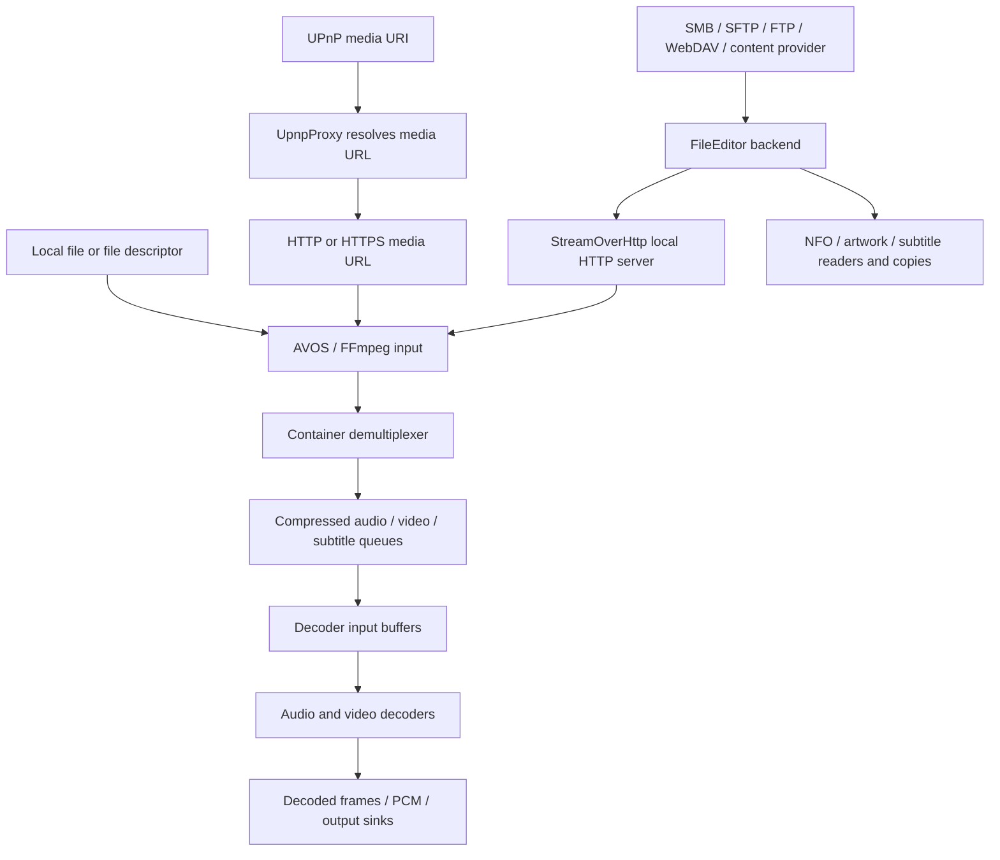

# Media I/O and buffering in Nova

Nova separates access to a file, delivery to a player, demultiplexing, and decoding.
Each stage has different buffering needs. A network request size, a queue of
compressed media, and a decoded video frame are not interchangeable buffers.
Sizes below use KiB/MiB (powers of 1024), even where the preferences say MB.

## Playback paths



* **Local files:** `AvosMediaPlayer` passes ordinary filesystem paths to native
  AVOS. File-descriptor entry points support descriptors with offsets and lengths;
  FFmpeg uses a custom input adapter for `fd://`. These paths bypass the Java HTTP
  proxy. Kernel filesystem caching and native I/O still apply.
* **Content URIs:** routing depends on the entry point. The URI player path can
  use `SmbProxy`/`ContentStorageFileEditor`; callers supplying a descriptor directly
  use the native descriptor path. A content provider is not necessarily local or
  seekable, and its length may be unknown.
* **HTTP(S):** playable URLs can reach FFmpeg directly. No SMB or SFTP library is
  involved. HTTP buffering, range support, TLS and server behavior determine I/O.
* **UPnP:** `UpnpProxy` resolves the UPnP object to a media URL and passes that URL
  to the player. It does not inherently copy the media through a Java buffer.
* **Other remote files:** a Java `FileEditor` supplies a stream to
  `StreamOverHttp`, and AVOS reads its HTTP URL. Despite its name, `SmbProxy`
  coordinates this path for several protocols, not just SMB.
* **Other players:** Android's player can use the same proxy, but has its own
  internal buffers. External-player launch code can also expose a proxy URL.
  AVOS preferences do not tune those players.

## Java responsibilities

### SmbProxy: player adapter and lifetime owner

`MediaLib/.../SmbProxy.java` converts a source URI into a URL the player or metadata
retriever understands. It resolves metadata when possible, constructs
`StreamOverHttp`, installs the resulting URL, and closes the proxy when replaced
or stopped. It does not itself hold a movie-sized byte buffer.

Player setup and metadata retrieval are distinct consumers. Playback can read
sequentially for hours; retrieving duration or a thumbnail often opens, probes,
seeks, and closes a large file after reading only a small fraction of it. File
extension and total size alone cannot distinguish these uses.

### StreamOverHttp: byte-stream-to-HTTP adapter

`FileCoreLibrary/.../StreamOverHttp.java` owns a server socket and HTTP request
sessions. A session opens the selected file at the requested offset through a
`FileEditor`, supplies length/range headers when possible, and copies the response.
It can also serve associated subtitles and posters.

There are two separate Java buffers:

* The **upstream buffer** combines small copy-loop reads into larger calls to the
  backend. The general-purpose default is **80 KiB**.
* The **copy buffer**, **8 KiB**, transfers those bytes to the HTTP socket. It does
  not cap the backend request size when an upstream buffer is present.

Playback mode allows a **1 MiB upstream buffer for the primary jcifs media stream**.
The actual `FileEditor` selects this policy: settings can route `smb://` to SMBJ,
which already buffers/prefetches internally. Metadata retrieval, sidecars, generic
file viewing, and other backends retain the general-purpose size. Both URI and
`MetaFile2` constructors support the playback intent explicitly.

For a known response length, the proxy caps buffer allocation to that length and
limits every refill to the remaining response bytes. A short range of a large
file therefore does not require a full playback-sized read. Unknown-length streams
keep bounded buffering and are read until EOF. Backend-internal prefetch can still
read ahead independently of these caller-side limits.

A seek can result in a new HTTP range request and a new backend stream. Replacement
media requests cancel older ones; associated-resource requests are handled
separately. Cancellation closes the socket, interrupts the worker, and arranges
upstream cleanup. The session limit also counts cleanup that has not completed.
Larger requests may increase wasted work and cancellation latency on a slow server.

The OS TCP buffers are another layer. They have their own sizes and flow control;
the 8 KiB Java copy buffer is not `SO_SNDBUF`, a TCP packet size, or an MTU.

## Backend buffering and protocol limits

`FileEditorFactory` chooses the backend. `smb://` can select jcifs or SMBJ, and
`sftp://` can select JSch or SSHJ according to settings. Explicit `smbj://` and
`sshj://` select those alternatives.

| Backend | Relevant buffering and flow control |
| --- | --- |
| Local storage / content provider | Caller buffers plus kernel/provider I/O; seek and length support vary for providers. |
| jcifs-ng | SMB2 receive limit configured to 1 MiB, further constrained by negotiation. With the multicredit-only dependency, reads follow caller demand up to that limit. A separate transport array holds a received SMB2 message before copying to the caller. |
| SMBJ | Configured default read size is 1 MiB before negotiated/credit limits. Its input stream buffers a response and requests the next block asynchronously. |
| JSch SFTP | SSH channel packet/window flow control plus pipelined SFTP reads. Nova configures a 64 KiB local packet size and a 4 MiB maximum local channel window; these are protocol capacities, not a 4 MiB media cache or an exact SFTP payload length. |
| SSHJ SFTP | Nova uses `ReadAheadRemoteFileInputStream(16)`: multiple requests can be outstanding independently of the proxy's buffer. |
| FTP / FTPS | Data-connection socket and library buffering; FTPS adds TLS processing. |
| WebDAV / WebDAVS | HTTP-client buffering and range handling; opening a response can supply length information absent from initial metadata. |

The jcifs send/receive settings are maximum transfer sizes, not instructions to
allocate or fetch 1 MiB for every file operation. Directory listings and attribute
queries are different operations from file-data reads. SMB multicredit permits
larger requests; it does not itself introduce background read-ahead. A 1 MiB SMB2
READ consumes 16 credits; concurrent operations share the connection's available
credits. See the [SMB2 credit calculation](https://learn.microsoft.com/en-us/openspecs/windows_protocols/ms-smb2/18183100-026a-46e1-87a4-46013d534b9c).

SFTP has no SMB credits. Request depth, SSH window, packet sizes, RTT and encryption
cost all affect throughput. Increasing a Java buffer cannot be assumed to reproduce
an improvement seen with another protocol.

Library-level read-ahead applies to every consumer of that stream unless explicitly
scoped. It can duplicate proxy buffering and perform unnecessary reads for image
header inspection, hashing or thumbnail extraction. The current jcifs dependency
uses multicredit without the experimental library-level read-ahead.

## Native AVOS buffering

### Input and demultiplexing

FFmpeg's AVIO layer has its own byte buffer. Its default starts at 32 KiB and is
doubled for streamed input; protocol/demuxer behavior can alter buffering or bypass
it for larger reads. This size is independent of the Java proxy and the AVOS stream
buffer preference. Filesystem inputs use native reads, while remote proxy inputs
use HTTP over the local socket.

The demultiplexer parses the container into compressed audio, video and subtitle
packets. The FFmpeg parser used for formats including MKV and MP4 queues these
packets until the playback threads consume them.

### Stream buffer preference: compressed-media budget

`stream_buffer_size` defaults to **24 MiB**. `PlayerActivity` passes it through
`LibAvos.setStreamBufferSize`, JNI, and the AVOS stream setup into the selected
parser.

For the FFmpeg parser this is the normal **combined compressed packet queue budget**,
including packet-accounting overhead. It is not an SMB read size and does not
preallocate a single 24 MiB network array. Queue-count limits, seek preroll and
audio starvation also affect admission; the current implementation permits bounded
overshoot rather than treating the normal budget as an exact total-memory ceiling.
Other parser implementations use a raw stream ring buffer before parsing, which
explains the preference's historical "before parser" description.

Increasing this budget can absorb longer network stalls or bitrate bursts. It does
not increase the sustained rate of a slow source. Approximate media duration is:

```text
seconds buffered = useful compressed bytes * 8 / media bitrate in bits/second
```

For example, a fully useful 24 MiB holds about 2 seconds at 100 Mbit/s. Actual
coverage depends on stream selection, interleaving, accounting and queue fullness.
The preference also applies to normal local AVOS playback; a local file still needs
demultiplexing and decoding even though the Java network path is absent.

### Maximum I-frame preference: compressed decoder input capacity

`stream_max_iframe_size` defaults to **6 MiB**. The native setter converts the value
to bytes. The video decoder input uses a circular bitstream buffer (CBE), with the
preference as the fallback capacity when decoder requirements do not override it.
Legacy parsing paths also use it as a minimum-data threshold.

The default CBE allocation has an equally sized overlap region: a 6 MiB logical
capacity therefore needs approximately **12 MiB of backing memory**. It must fit
the compressed access unit including any added codec headers/conversion overhead.
Increasing this value helps oversized compressed frames, not network throughput.
It is independent of the packet-queue budget and of decoded image dimensions.

### Decoder and output buffers

After compressed input come decoder reference/reordered pictures, output surfaces,
render queues, audio decode/filter buffers and sink queues. Their sizes depend on
codec, resolution, pixel format, hardware decoder and output mode. Hardware surface
memory may not appear as Java heap usage. Neither of the two preferences describes
total player memory, and compressed-file bitrate does not determine decoded-frame
memory consumption.

## Backpressure, seeking and memory

When native queues fill, parsing pauses. HTTP consumption eventually slows, socket
writes block, and the Java proxy stops asking its backend for more bytes. Library
prefetch and socket queues may advance further within their own limits. Local
playback similarly stops issuing native reads when downstream capacity is exhausted.
No layer needs to hold the entire video to sustain playback.

Memory accounting must include simultaneous copies: proxy data, transport response,
library prefetch, socket buffers, FFmpeg packets, CBE overlap and decoder surfaces.
Concurrent thumbnails or file reads multiply some of these costs. Temporary Java
arrays also contribute allocation/GC pressure even after their contents are copied.

Seeking invalidates some queued media and can discard fetched-but-unused bytes.
Large buffers favor sequential throughput; modest probes and bounded ranges favor
startup, scrubbing, cancellation and responsiveness of other work on the same server.

## Scraping, sidecars and small files

NFO parsers and SMB image handlers normally obtain `FileEditor` streams directly.
Artwork copying currently uses 8 KiB chunks; `CopyCutEngine`, used for remote
subtitle prefetch, uses 32 KiB chunks. These operations do not pass through AVOS's
media queues or inherit a playback proxy's large buffer.

Video metadata and thumbnail retrieval do use the player adapter for remote media,
but retain general-purpose proxy buffering. External players can fetch subtitle or
poster resources through HTTP; those resources also keep modest buffers. A large
movie opened to read a hash or a thumbnail is still a short-lived reader, so policies
should follow the consumer's intent rather than just MIME type or file size.

## Tuning and validation

Change one layer at a time. First establish sufficient source throughput, then
adjust compressed-media buffering for measured stalls, and change compressed-frame
capacity only when frame sizes require it. Preserve small-file behavior and monitor
latency of concurrent scraping, not just aggregate bandwidth.

The host transfer diagnostic exercises the file backend and HTTP proxy, replacing
AVOS with a Java HTTP client whose read buffer is 256 KiB. It measures neither
decoding nor native queue behavior. Its explicit upstream-size override permits
controlled comparisons; see [TEST.md](TEST.md#comparing-upstream-buffer-sizes-host-only).

On Android, compare 256 KiB, 512 KiB and 1 MiB backend-facing reads using the same
server/file and repeated runs. Then test actual playback: first-frame latency,
seeking, stop/reopen, sustained high-bitrate playback, Java/native memory and GC,
and NFO/JPG/subtitle work during playback. Include local files, unknown-length
providers, small HTTP ranges and at least one encrypted protocol. Host throughput
alone does not justify increasing every buffer or changing the 24/6 MiB defaults.

## Source map

Paths are relative to the multi-repository workspace root:

* `FileCoreLibrary/src/com/archos/filecorelibrary/StreamOverHttp.java`
* `FileCoreLibrary/src/com/archos/filecorelibrary/FileEditorFactory.java`
* `FileCoreLibrary/src/com/archos/filecorelibrary/{jcifs,smbj,sftp,sshj}/`
* `MediaLib/src/com/archos/medialib/{Proxy,SmbProxy,UpnpProxy,AvosMediaPlayer,LibAvos}.java`
* `Video/src/main/java/com/archos/mediacenter/video/player/PlayerActivity.java`
* `Video/src/main/java/com/archos/mediacenter/video/utils/{PlayUtils,VideoPreferencesCommon}.java`
* `native/avos/Source/{avos_mp_video,stream,stream_parser,stream_parser_ffmpeg,stream_video,cbe}.c`
* `native/avos/ext/ffmpeg/libavformat/{avio,aviobuf,http}.c`
